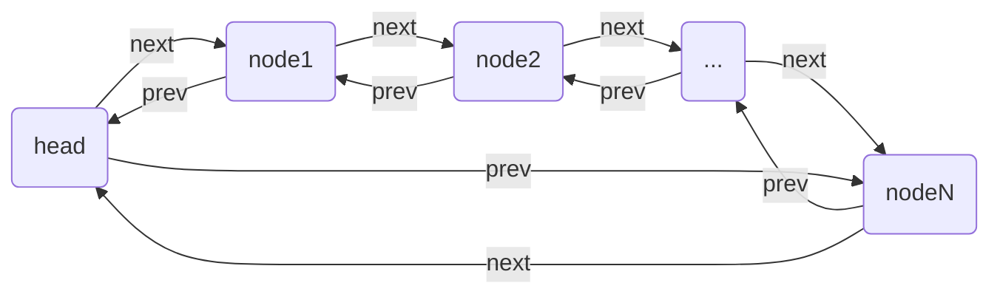
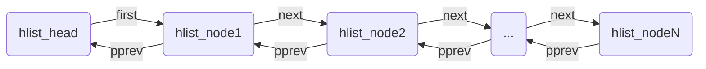

# Linux内核双向链表

`list_head`结构组成的列表适用于对遍历时间要求较高的地方，比如进程的管理。我们在看`task_struct`结构体中就有多个`list_head`类型的变量，用来管理task。

`hlist_head`和`hlist_node`主要用于散列表中，因为内核中存在大量的hash表，使用这种方式实现的散列表因为少一个指针，可以节省一半的空间。

## 环形双向链表

Linux 内核中环形双向链表`list_head`实现的优点包括：
- 高效的插入和删除操作：在链表的任意位置进行插入和删除节点的时间复杂度均为 `O(1)`，因为只需要修改几个指针即可。
- 方便的双向遍历：可以从链表的头部和尾部两个方向进行遍历，这在许多算法和数据处理场景中非常有用，提供了更多的灵活性。
- 内存占用相对较小：只需要两个指针（prev和next）来维护链表节点之间的关系，相比于一些更复杂的数据结构，内存开销较为节省。
- 广泛的适用性：可用于各种内核模块和数据结构中，如设备驱动、进程管理、文件系统等，能够有效地组织和管理相关数据。

然而，它也存在一些缺点：
- 随机访问效率低：与数组等数据结构不同，双向链表不支持直接通过索引进行快速的随机访问，要获取特定位置的节点，需要从头或尾开始遍历，时间复杂度为 `O(n)`。
- 空间开销：尽管单个节点的内存开销相对较小，但对于大量的小节点，额外的指针空间可能会累积起来造成一定的内存浪费，特别是当节点本身存储的数据较小时。
- 遍历性能：在遍历链表时，由于需要通过指针依次访问节点，相比于数组的连续内存访问，缓存命中率可能较低，从而影响性能。

总体而言，Linux 内核中的双向链表在大多数需要动态、灵活地组织数据且对插入、删除操作频繁的场景中表现出色，其缺点在特定的应用场景下可能会带来一定的限制，但通过合理的设计和优化，可以有效地减轻这些影响。


### 结构体定义
```h
struct list_head {
	struct list_head *next, *prev;
};
```



<p class="img-caption"> list_head链表示例 </p>

> 注：next指向下一个list_head结构的地址，prev指向前一个list_head结构的地址。

### 函数原型

#### 表头初始化

- 方式一

```h
// 定义并初始化
#define LIST_HEAD_INIT(name) { &(name), &(name) }

#define LIST_HEAD(name) \
	struct list_head name = LIST_HEAD_INIT(name)

// 示例：
LIST_HEAD(test_head);
```

- 方式二

```h
static inline void INIT_LIST_HEAD(struct list_head *list)
{
	list->next = list;
	list->prev = list;
}

// 示例：
struct list_head test_head;
INIT_LIST_HEAD(&test_head);

```


#### 新增节点


```h
static inline void __list_add(struct list_head *new,
			      struct list_head *prev,
			      struct list_head *next)
{
	next->prev = new;
	new->next = next;
	new->prev = prev;
	prev->next = new;
}

/* 新增节点到表头 */
static inline void list_add(struct list_head *new, struct list_head *head)
{
	__list_add(new, head, head->next);
}


/* 新增节点到列表尾 */
static inline void list_add_tail(struct list_head *new, struct list_head *head)
{
	__list_add(new, head->prev, head);
}
```

#### 删除节点

```h
static inline void __list_del(struct list_head *prev, struct list_head *next)
{
	next->prev = prev;
	prev->next = next;
}

static inline void __list_del_entry(struct list_head *entry)
{
	__list_del(entry->prev, entry->next);
}

static inline void list_del(struct list_head *entry)
{
	__list_del_entry(entry);
	entry->next = LIST_POISON1;
	entry->prev = LIST_POISON2;
}

```

#### 查询相关

```h
// 假设有自定义结构体和数据
struct list_node {
    int data;
    struct list_head list;
}

LIST_HEAD(test_head);
```

```h
/* 获取当前节点的外层结构体 */
#define list_entry(ptr, type, member) \
	container_of(ptr, type, member)

/* 获取首个节点 */
#define list_first_entry(ptr, type, member) \
	list_entry((ptr)->next, type, member)

// 示例：
struct list_node* first = list_first_entry(&test_head, struct list_node, list)


/* 获取最后节点 */
#define list_last_entry(ptr, type, member) \
	list_entry((ptr)->prev, type, member)

// 示例：
struct list_node* last = list_last_entry(&test_head, struct list_node, list)


/* 获取下一个节点 */
#define list_next_entry(pos, member) \
	list_entry((pos)->member.next, typeof(*(pos)), member)

// 示例：
struct lis_node* next = list_next_entry(first, list);
```

```h
/* 遍历链表 */
#define list_for_each_entry(pos, head, member)				\
	for (pos = list_first_entry(head, typeof(*pos), member);	\
	     !list_entry_is_head(pos, head, member);			\
	     pos = list_next_entry(pos, member))

// 示例：
struct list_node *node;
list_for_each_entry(node, list_head, list) {
    printf("%d ", node->data);
}


/* 反向遍历链表 */
#define list_for_each_entry_reverse(pos, head, member)			\
	for (pos = list_last_entry(head, typeof(*pos), member);		\
	     !list_entry_is_head(pos, head, member); 			\
	     pos = list_prev_entry(pos, member))

// 示例：
struct list_node *node;
list_for_each_entry_reverse(node, list_head, list) {
    printf("%d ", node->data);
}

/* 安全地遍历链表，支持删除节点 */
#define list_for_each_entry_safe(pos, n, head, member)			\
	for (pos = list_first_entry(head, typeof(*pos), member),	\
		n = list_next_entry(pos, member);			\
	     !list_entry_is_head(pos, head, member);			\
	     pos = n, n = list_next_entry(n, member))

// 示例：
struct list_node *node, *next;
list_for_each_entry_safe(node, next, list_head, list) {
    printf("%d ", node->data);
    list_del(&node->list);
    free(node);
}
```

#### 其他函数

```h
/* 用new节点替换old节点 */
static inline void list_replace(struct list_head *old,
				struct list_head *new);

/* 用new节点替换old节点，并将old节点初始化 */
static inline void list_replace_init(struct list_head *old,
				     struct list_head *new);

/* 将节点list移动到head链表中头部 */
static inline void list_move(struct list_head *list, struct list_head *head);

/* 将节点list移动到head链表中尾部 */
static inline void list_move_tail(struct list_head *list,
				  struct list_head *head)

/* 检查list是否为首节点 */
static inline int list_is_first(const struct list_head *list, const struct list_head *head)

/* 检查list是否为尾节点 */
static inline int list_is_last(const struct list_head *list, const struct list_head *head)

/* 检查list是否为head节点 */
static inline int list_is_head(const struct list_head *list, const struct list_head *head)

/* 检查链表是否为空 */
static inline int list_empty(const struct list_head *head)
```

### 代码示例

@import "assets/sample_list.c"

## 表头链型双向链表

Linux 内核中的单向链表 `hlist`（哈希链表）具有以下优点和缺点：

优点：
- 内存效率：相比双向链表，`hlist` 只需要一个指针来指向下一个节点，节省了内存空间。在一些对内存使用较为敏感的场景中，这是一个显著的优势。
- 适用于特定场景：在哈希表等数据结构中，当链表长度通常较短时，单向链表的性能足够且能减少内存占用。
- 简单性：结构相对简单，实现和操作的代码复杂度较低。

缺点：
- 遍历限制：由于是单向链表，只能从表头向表尾进行遍历，反向遍历需要额外的处理，增加了复杂性。
- 操作复杂性：插入和删除操作相对于双向链表来说，可能会稍微复杂一些，因为需要处理更多的指针调整。
- 不适合长链表：当链表长度较长时，由于不能反向遍历，查找和操作的效率可能会受到影响。

总的来说，`hlist` 在特定的场景下，如内存受限且链表较短的情况下，能够发挥其优势。但在需要频繁双向遍历或对操作便捷性要求较高的场景中，可能不如双向链表适用。

### 结构体定义
```h
struct hlist_head {
	struct hlist_node *first;
};

struct hlist_node {
	struct hlist_node *next, **pprev;
};
```


<p class="img-caption"> hlist链表示例 </p>

> 注：next指向下一个hlist_node结构的地址，而pprev指向前一个hlist_node的next指针。

### 函数原型

#### 初始化
```h
/* 初始化表头 */
#define HLIST_HEAD_INIT { .first = NULL }
#define INIT_HLIST_HEAD(ptr) ((ptr)->first = NULL)

/* 初始化节点 */
static inline void INIT_HLIST_NODE(struct hlist_node *h)
{
	h->next = NULL;
	h->pprev = NULL;
}

```

#### 新增

```h
static inline void hlist_add_head(struct hlist_node *n, struct hlist_head *h)
{
	struct hlist_node *first = h->first;

	n->next = first;
	if (first)
		first->pprev = &n->next;
	h->first = n;
	n->pprev = &h->first;
}
```

#### 删除

```h

static inline int hlist_unhashed(const struct hlist_node *h)
{
	return !h->pprev;
}

static inline void __hlist_del(struct hlist_node *n)
{
	struct hlist_node *next = n->next;
	struct hlist_node **pprev = n->pprev;

	*pprev = next;
	if (next)
		next->pprev = pprev;
}

static inline void hlist_del(struct hlist_node *n)
{
	__hlist_del(n);
	n->next = LIST_POISON1;
	n->pprev = LIST_POISON2;
}

static inline void hlist_del_init(struct hlist_node *n)
{
	if (!hlist_unhashed(n)) {
		__hlist_del(n);
		INIT_HLIST_NODE(n);
	}
}
```

#### 查询相关

```h

#define hlist_entry(ptr, type, member) container_of(ptr, type, member)

#define hlist_entry_safe(ptr, type, member) \
	({ typeof(ptr) ____ptr = (ptr); \
	   ____ptr ? hlist_entry(____ptr, type, member) : NULL; \
	})

#define hlist_for_each_entry(pos, head, member)				\
	for (pos = hlist_entry_safe((head)->first, typeof(*(pos)), member);\
	     pos;							\
	     pos = hlist_entry_safe((pos)->member.next, typeof(*(pos)), member))

#define hlist_for_each_entry_safe(pos, n, head, member) 		\
	for (pos = hlist_entry_safe((head)->first, typeof(*pos), member);\
	     pos && ({ n = pos->member.next; 1; });			\
	     pos = hlist_entry_safe(n, typeof(*pos), member))
```

### 代码示例

@import "assets/sample_hlist.c"

## 参考资料

- https://raw.gitcode.com/gh_mirrors/li/linux/raw/master/scripts/include/list_types.h
- https://raw.gitcode.com/gh_mirrors/li/linux/raw/master/scripts/include/list.h
- https://blog.csdn.net/shenwanjiang111/article/details/105355016