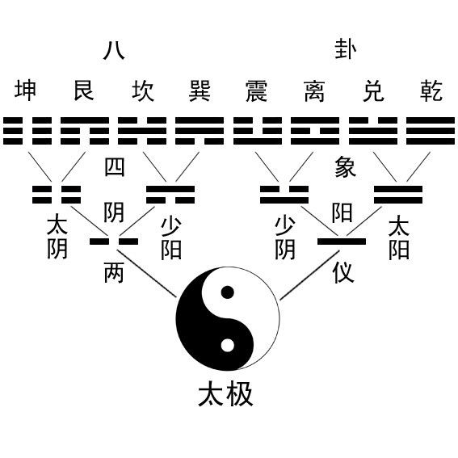
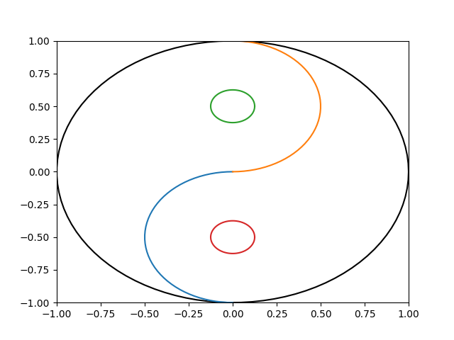

# 测试页面


## 标题a

### 标题a.b
#### 标题a.b.c

##### 标题a.b.c.d


表格

| A | B | C|
|---|---|---|
| aa| bb| cc|
| aa| bb| cc|
| aa| bb| cc|
| aa| bb| cc|

## 列表

- 测试
- list

1. 数字列表
2. 二
3. 三
4. 四

## LaTex

inline math: $e^{i\pi} = -1$, 
block math:
$$
f(x) = sin(x)\times cos(x)
$$

## 图片

图片链接

- 当前目录



- 子目录



## 次级页面

[次级页面1](page1/page1.md)

[次级页面2](page2/page2.md)

## 代码测试

### Python

```python
import base64
from Crypto.Cipher import AES
from Crypto.Util.Padding import pad, unpad

# 加密函数
def encrypt(text, key):
  # 确保密钥长度为 16 字节
  if len(key) not in [16, 24, 32]:
    raise ValueError("密钥长度必须是 16、24 或 32 字节")
  # 创建 AES 加密器
  aes = AES.new(key.encode(), AES.MODE_ECB)
  # 对明文进行填充
  padded_text = pad(text.encode(), AES.block_size)
  # 加密填充后的明文
  encrypted_text = aes.encrypt(padded_text)
  # 对加密后的字节数据进行 Base64 编码并转换为字符串
  return base64.b64encode(encrypted_text).decode('utf-8')

# 解密函数
def decrypt(encrypted_text, key):
  # 确保密钥长度为 16 字节
  if len(key) not in [16, 24, 32]:
    raise ValueError("密钥长度必须是 16、24 或 32 字节")
  # 创建 AES 解密器
  aes = AES.new(key.encode(), AES.MODE_ECB)
  # 对 Base64 编码的密文进行解码
  base64_decrypted = base64.b64decode(encrypted_text)
  # 解密解码后的密文
  decrypted_text = aes.decrypt(base64_decrypted)
  # 去除填充
  unpadded_text = unpad(decrypted_text, AES.block_size)
  # 将解密后的字节数据转换为字符串
  return unpadded_text.decode('utf-8')

# 示例使用
text = "Hello, Python!"
key = "1234567890123456"  # 16 字节密钥
encrypted = encrypt(text, key)
print("加密后的文本:", encrypted)
decrypted = decrypt(encrypted, key)
print("解密后的文本:", decrypted)
```

```py
print("long height output test")
for i in range(100):
  print(i)
```

```py
print("long width output test")
for i in range(100):
  print(i, end = ', ')
```

```py
print("test for long width and height output")
n = 100
for i in range(n):
  print('*' + '*'*2*i, 1+2*i)
```

```py
import time
print("test for timeout")
time.sleep(20)
```

```py
# %matplotlib /tmp/plot1.png
import matplotlib.pyplot as plt
import numpy as np
plt.figure()
x = np.linspace(0, 4*np.pi, 100)
w = np.pi/2
y = np.sin(x*w)*x
z = np.cos(x*w)*x
plt.plot(x, y)
plt.savefig('/tmp/plot1.png')

plt.plot(x, z)
# %matplotlib /tmp/plot2.jpg
plt.savefig('/tmp/plot2.jpg')

plt.close()
print("Test for plotting a figure")
```

### C

```c
#include <stdio.h>
int main() {
  int a, b;
  printf("a=%d %p\n", a, &a);
  printf("Hello C\n");
  return 0;
}

// this is a long line code example for testing overflow on the code block in html page
```

### C++

```cpp
#include <cstdio>
int main() {
  printf("Hello c++!");
  return 0;
}
```

```cpp
#include <iostream>
int main() {
  std::cout << "Hello cpp!";
  return 0;
}
```

### Javascript

```js
(function () {
  return "Hello JavaScript";
})();
```

### Json

```json
{
  "data": {
  "list": ["a", "b", "中文"]
  },
  "ret": "success"
}
```

```json
{
  a: "wrong syntax",
  3: 4
}
```

@import "https://json-schema.org/draft-07/schema#" json

### Go

```go
package main

import "fmt"

func main() {
  fmt.Println("Hello, Go!")
}
```

### Rust

```rust
fn main() {
  println!("Hello, Rust!");
}
```

### Java

```java
public class HelloWorld {
  public static void main(String[] args) {
  System.out.println("Hello, Java!");
  }
}
```

### Lua

```lua
Person = {}
Person.__index = Person

function Person:new(name, age)
  local self = setmetatable({}, Person)
  self.name = name or "Unknown"
  self.age = age or 0
  return self
end

function Person:getName()
  return self.name
end

function Person:getAge()
  return self.age
end

function Person:setName(name)
  self.name = name
end

function Person:setAge(age)
  self.age = age
end

local person = Person:new("Alice", 30)
print("Name:", person:getName())
print("Age:", person:getAge())
person:setName("Bob")
print("Updated Name:", person:getName())
print("Hello Lua")
```

### shell

```sh

echo "Hello, Shell"

echo "test" > test.txt
realpath test.txt
cat test.txt

```

### Assembly

```assembly
	.section	__TEXT,__text,regular,pure_instructions
	.build_version macos, 12, 0	sdk_version 12, 3
	.globl	_f                              ## -- Begin function f
	.p2align	4, 0x90
_f:                                     ## @f
	.cfi_startproc
## %bb.0:
	pushq	%rbp
	.cfi_def_cfa_offset 16
	.cfi_offset %rbp, -16
	movq	%rsp, %rbp
	.cfi_def_cfa_register %rbp
	movq	_r@GOTPCREL(%rip), %rax
	movl	(%rax), %ecx
	movq	_x@GOTPCREL(%rip), %rax
	movl	%ecx, (%rax)
	movq	_y@GOTPCREL(%rip), %rax
	movl	$1, (%rax)
	popq	%rbp
	retq
	.cfi_endproc
                                        ## -- End function
	.comm	_r,4,2                          ## @r
	.comm	_x,4,2                          ## @x
	.comm	_y,4,2                          ## @y
.subsections_via_symbols
```

```nasm
section .data
    msg db "Hello world!", 0ah

section .text
    global _start

_start:
    mov rax, 1
    mov rdi, 1
    mov rsi, msg
    mov rdx, 13
    syscall
    mov rax, 60
    mov rdi, 0
    syscall
```

### Diff
```diff
2c2
< test_opt.o:	file format mach-o 64-bit x86-64
---
> test_no_opt.o:	file format mach-o 64-bit x86-64
10,12c10,12
<        b: 8b 00                        	movl	(%rax), %eax
<        d: 48 8b 0d 00 00 00 00         	movq	(%rip), %rcx            ## 0x14 <_f+0x14>
<       14: 89 01                        	movl	%eax, (%rcx)
---
>        b: 8b 08                        	movl	(%rax), %ecx
>        d: 48 8b 05 00 00 00 00         	movq	(%rip), %rax            ## 0x14 <_f+0x14>
>       14: 89 08
```

```diff
diff --git a/test_opt.s b/test_no_opt.s
index e5c3b89..0c028eb 100644
--- a/test_opt.s
+++ b/test_no_opt.s
@@ -1,5 +1,5 @@

-test_opt.o:    file format mach-o 64-bit x86-64
+test_no_opt.o: file format mach-o 64-bit x86-64

 Disassembly of section __TEXT,__text:

@@ -7,9 +7,9 @@ Disassembly of section __TEXT,__text:
        0: 55                                   pushq   %rbp
        1: 48 89 e5                             movq    %rsp, %rbp
        4: 48 8b 05 00 00 00 00                 movq    (%rip), %rax            ## 0xb <_f+0xb>
-       b: 8b 00                                movl    (%rax), %eax
-       d: 48 8b 0d 00 00 00 00                 movq    (%rip), %rcx            ## 0x14 <_f+0x14>
-      14: 89 01                                movl    %eax, (%rcx)
+       b: 8b 08                                movl    (%rax), %ecx
+       d: 48 8b 05 00 00 00 00                 movq    (%rip), %rax            ## 0x14 <_f+0x14>
+      14: 89 08                                movl    %ecx, (%rax)
       16: 48 8b 05 00 00 00 00                 movq    (%rip), %rax            ## 0x1d <_f+0x1d>
       1d: c7 00 01 00 00 00                    movl    $1, (%rax)
       23: 5d                                   popq    %rbp
```

### Matlab

```matlab
x = linspace(0, 2*pi, 100);
y = sin(x);
plot(x, y);
title('Sine Wave');
xlabel('x');
ylabel('sin(x)');
grid on;
```

### Kotlin

```kotlin
fun main() {
  println("Hello, Kotlin!")
}
```


### Haskell
```haskell
fibonacci :: Int -> Int
fibonacci 0 = 0
fibonacci 1 = 1
fibonacci n = fibonacci (n - 1) + fibonacci (n - 2)

main :: IO ()
main = do
  print $ map fibonacci [0..9]
```

### Prolog

```prolog
% Define a fact
parent(john, mary).
parent(mary, susan).
parent(susan, tom).

% Define a rule
ancestor(X, Y) :- parent(X, Y).
ancestor(X, Y) :- parent(X, Z), ancestor(Z, Y).

% Query examples
% ?- ancestor(john, tom).
% ?- ancestor(mary, tom).
```

### YAML

```yaml
name: John
age: 30
city: New York
```

## 引用

- 引用1[^abc]
- 引用2[^Github]
- 链接>>[Gitee](//gitee.com)


-------

[^abc]:# "this is a reference"

[^Github]: //github.com "jump to github" 

