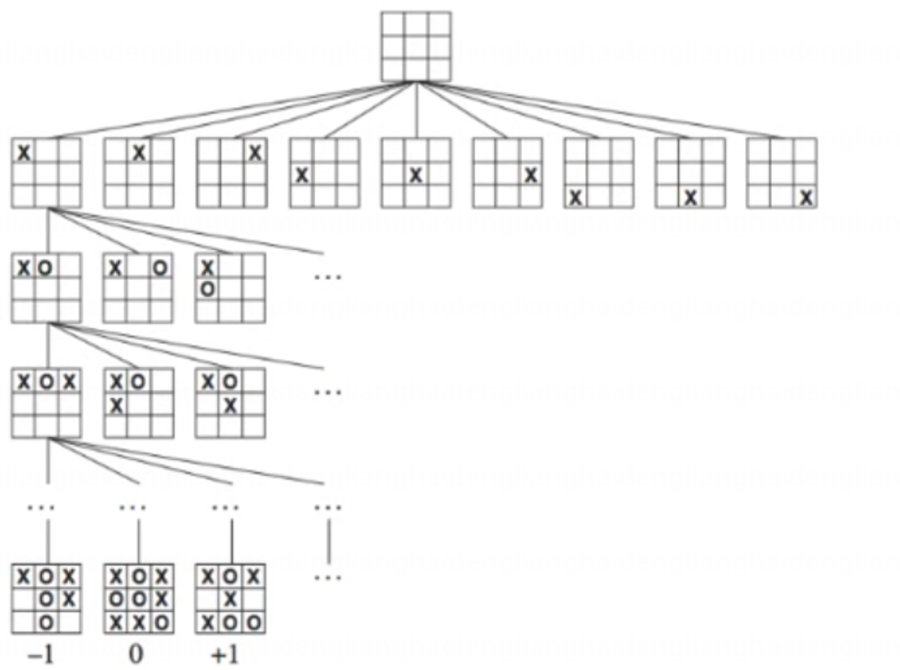
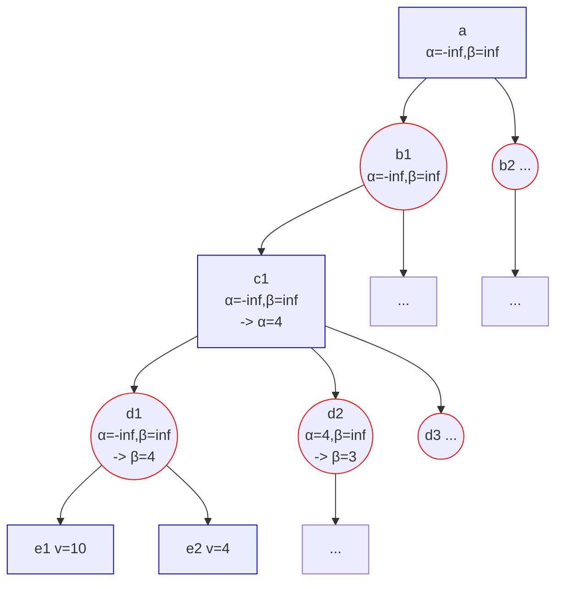

# 极小化极大算法（Minimax Algorithm）与alpha-beta剪枝

## 极小化极大算法介绍

> 极小化极大算法是一种在零和博弈中常用的决策算法，是一种找出失败的最大可能性中的最小值的算法。通过构建决策树来模拟对手的可能行动，以此来预测最佳的行动策略。这种算法尤其适用于像井字棋、黑白棋、五子棋这样的完全信息游戏。
>
> 零和游戏：我赢等价于对方输，我输等价于对方赢，没有双赢或双输。
> 完全信息：每一步后，游戏的局面对于双方都是可知的。

假设A与B进行对弈，当A决策当前应该怎么走时，会思考所有可能的走法且会假设B也是走他的最好策略，
然后A会选择最小化B的最好策略的策略走法。

对弈的每一步决策过程可以形成一棵决策树，决策的过程就是要选择一个在最坏的情况下能拿到最好分数的分支走。

井字棋决策树示例

## 游戏示例

### Minimax算法实现井字棋游戏

<iframe width="100%" height="300px" src="assets/tictactoe.html"></iframe>
Minimax算法有个缺点就是决策树大小是指数级别增长的，无法在短时间遍历所有的结点。
因此，需要优化，即对决策树进行裁剪。搜索决策路径时，可以砍掉一些根本不需要的搜索（剪枝），降低计算代价。由此，我们有了 $\alpha-\beta$ 剪枝算法。

## alpha-beta 剪枝

在决策树上，每个节点都有一个分数还有2个上下界即 $\alpha$ 和 $\beta$ 。记 $v$ 为节点的分数，且 $\alpha \leq v \leq \beta$，即 $\alpha$ 为最大下界，$\beta$ 为最小上界。
当 $\alpha \geq \beta$ 时，该节点的分支就不必继续搜索（即可以进行剪枝）。
注意，当 $\alpha = \beta$ 时，也可以剪枝，是因为不会有更好的结果了，但可能有更差的结果。

如下图所示，是一个搜索剪枝的示例，其中蓝框是MAX节点（最大化 $\alpha$ 值），红框是MIN节点（最小化 $\beta$ 值）。

- 初始时，根节点的 $\alpha$ 和 $\beta$ 分别为 $-\infty$ 和 $\infty$
- 深度优先，从路径a->b1->c1->d1->e1开始搜索（e是叶子节点或最大搜索深度），$\alpha$ 和 $\beta$ 会从父节点传到子节点，走完e层开始回走更新
- 对于d1节点（是MIN节点）会依次遍历所有子节点（e1、e2）得到最小分数4，因此最终分数最多不会超过4，将当前的 $\beta$ 更新为4（MIN节点的最终分数即为 $\beta=4$，并返回到上层c1节点）
- 再回到c1节点（是MAX节点）取下面最大分数4，即最小分数不低于4，于是将 $\alpha $ 更新为4（如果d2分支的 $\beta$ 值大于4，则将 $\alpha$ 更新为d2的 $\beta$ 值）
- 再到d2节点（c1会传过来 $\alpha$ 值），再遍历子节点时更新 $\beta$ 值后，发现 $\alpha\ge\beta$ 则可进行剪枝，后面的分节不用再搜索，返回最终分数为 $\beta = 3$
- 再返回到c1节点，若发现 $\alpha \ge\beta$ 则也可进行剪枝，最终c1的分数为 $\alpha=4$ 

### alpha-beta 剪枝实现五子棋

<iframe width="100%" height="700px" src="assets/gomoku.html"></iframe>

## 参考资料

- https://zhuanlan.zhihu.com/p/658351019
- https://blog.csdn.net/weixin_42165981/article/details/103263211
- https://oi-wiki.org/search/alpha-beta/