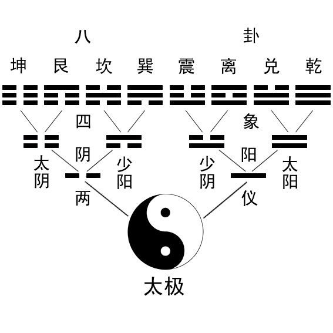
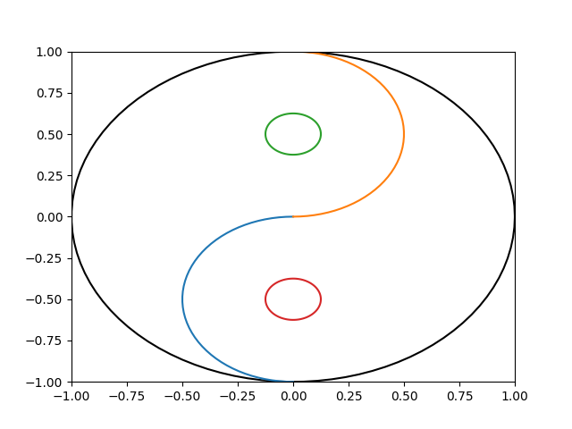

# index 页面


## 列表

- 测试
- list


1. 数字列表
2. 二
3. 三
4. 四

## LaTex


$$
f(x) = sin(x)\times cos(x)
$$


## 图片

图片链接

- 当前目录



- 子目录




## 次级页面


[次级页面1](page1/page1.md)


[次级页面2](page2/page2.md)


## 代码测试


### python

```python

# 加密函数
def encrypt(text, key):
    aes = AES.new(pad(key), AES.MODE_ECB)
    encrypted_text = aes.encrypt(pad(text))
    return str(base64.encodebytes(encrypted_text), encoding='utf-8')

# 解密函数
def decrypt(encrypted_text, key):
    aes = AES.new(pad(key), AES.MODE_ECB)
    base64_decrypted = base64.decodebytes(encrypted_text.encode(encoding='utf-8'))
    decrypted_text = str(aes.decrypt(base64_decrypted), encoding='utf-8').replace('\0', '')
    return decrypted_text
```


### c

```c
int main() {
  int a, b;
  // ....
  return 0;
}
```


### javascript


```js
function loadStyle(url) {
    var link = document.createElement('link');
    link.type = 'text/css';
    link.rel = 'stylesheet';
    link.href = url;
    document.getElementsByTagName('head')[0].appendChild(link);
}

```


### json

```json
{
  "data": {
    "list": ["a", "b", "c"]
  },
  "ret": "success"
}
```

